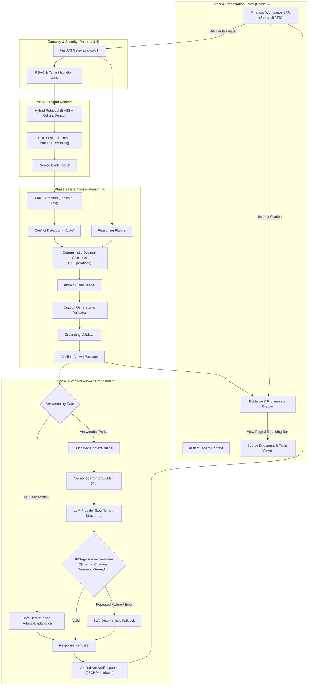

# System Architecture — FINARQ (Financial Document Intelligence & Verified Reasoning Platform)

> **Current Status: Production Ready Architecture**  
> This document specifies the comprehensive architectural vision, design principles, boundaries, and roadmap for the FINARQ platform.

---

## 1. System Mission

The platform's mission is to provide an enterprise-grade, verifiable, and numerically precise question-answering and document intelligence engine over complex corporate and financial disclosures, including:
- SEC filings (10-K, 10-Q, 8-K)
- Annual and quarterly earnings reports
- Bank statements and loan contracts
- Structured financial tables and balance sheets

### Core Axioms
1. **The Source Documents are the Ground Truth**: The Large Language Model (LLM) is not a trusted source of factual knowledge. It acts strictly as an instruction-following synthesis and extraction engine over retrieved evidence.
2. **Deterministic Calculations over LLM Arithmetic**: Financial calculations (percentages, margins, ratios, growth rates) must be computed by deterministic execution tools rather than relying on generative model arithmetic.
3. **Auditable Evidence & Precise Citations**: Every factual claim must be explicitly traceable to source document metadata (Document ID, Page Number, Table/Paragraph Bounding Box, Exact Text Snippet).
4. **Zero Cross-Tenant Leakage**: Complete isolation across organizational tenants via cryptographic token derivation, repository row scoping, and vector payload contracts.
5. **Production Resilience & Observability**: Graceful degradation under load, three-state circuit breakers, bounded concurrency worker daemons, and end-to-end trace context propagation.

---

## 2. Status Matrix: Complete Implementation Status

| Subsystem / Capability | Status | Phase Details |
| :--- | :--- | :--- |
| **Architectural Boundaries & Layering** | **Implemented** | Clean/Hexagonal Architecture with pure domain protocols (Phase 0) |
| **Configuration Management & Secrets** | **Implemented** | Pydantic Settings with env parsing, secret masking, timeouts & worker config (Phase 0/7) |
| **Structured Logging & Correlation Tracing** | **Implemented** | JSON/Text logger with async-safe `X-Request-ID` / `job_id` context propagation (Phase 0/7) |
| **Domain Exception & Error Handlers** | **Implemented** | Hierarchical exceptions + RFC 7807 problem details (Phase 0) |
| **FastAPI Core, Health Probes & Version**| **Implemented** | `/health`, `/ready`, `/version`, `/api/v1/version`, `/metrics`, and domain routers (Phase 0/7) |
| **Test & Code Quality Infrastructure** | **Implemented** | Pytest (250+ tests), Ruff lint/format, MyPy strict across 270 files (Phase 0-7) |
| **Document Ingestion & OCR Parsing** | **Implemented** | **Phase 1**: PDFClassifier, PyMuPDFParser, Tesseract OCR fallback |
| **Financial Table Extraction & Normalization**| **Implemented** | **Phase 1**: Parenthetical negative `(1,234.50)` -> `-1234.50`, Markdown grids |
| **SEC Filing Structure Detection** | **Implemented** | **Phase 1**: Item 1, 1A, 7, 8 and Financial Statement breadcrumbs |
| **Structure-Aware Semantic Chunking** | **Implemented** | **Phase 1**: Section boundary respect + dedicated table chunks |
| **Vector Store & Relational Repositories** | **Implemented** | **Phase 1**: Qdrant vector index with payload lineage + PostgreSQL ORM |
| **Object Storage (Filesystem & S3)** | **Implemented** | **Phase 1**: Path traversal defense, atomic temp writes, companion metadata |
| **Hybrid Search & Candidate Fusion (RRF)**| **Implemented** | **Phase 2**: Okapi BM25 + Qdrant Dense Vector + Reciprocal Rank Fusion ($k=60$) |
| **Cross-Encoder Reranking Engine** | **Implemented** | **Phase 2**: Cross-encoder adapter + deterministic MockReranker ($N \le 50$) |
| **Evidence Diversity & Table Preservation** | **Implemented** | **Phase 2**: Multi-period representation, table preservation, doc diversity |
| **Retrieval Evaluation & Benchmark Suite** | **Implemented** | **Phase 2**: Recall@K, Precision@K, MRR, NDCG@K, HitRate@K |
| **Deterministic Numerical Reasoning Engine**| **Implemented** | **Phase 3**: Decimal precision calculator (11 operations), zero-division safety |
| **Structured Fact Extraction & Conflicts**  | **Implemented** | **Phase 3**: Cell-level fact extraction, >0.1% conflict detection & table priority |
| **Verifiable Citations & Grounding Audit**   | **Implemented** | **Phase 3**: Exact claim-to-chunk verification, 7-state answerability gate |
| **Verified LLM Answer Orchestration**      | **Implemented** | **Phase 4**: Gated synthesis, prompt versioning, 8-stage answer validator, fallback |
| **Evaluation Framework & Benchmark Suite**  | **Implemented** | **Phase 5**: Multi-layered regression baselines, Golden Benchmark (40 questions) |
| **Distributed Tracing & Metrics Registry**   | **Implemented** | **Phase 5**: Pipeline spans, latency histograms, token counters, Prometheus `/metrics` |
| **Authentication, RBAC & Multi-Tenancy**     | **Implemented** | **Phase 6**: Bearer JWT tokens, Scrypt hashing, 4-tier RBAC, Tenant isolation |
| **Immutable Audit Logging & Security Invariants**| **Implemented**| **Phase 6**: Cryptographic token validation, startup invariant verification |
| **Hardened Multi-Stage Containerization**    | **Implemented** | **Phase 7**: Builder + minimal runtime stage, `USER 10001:10001`, `entrypoint.sh` |
| **Standalone Ingestion Worker Daemon**       | **Implemented** | **Phase 7**: Bounded concurrency (`WorkerDaemon`), graceful `SIGTERM` drain |
| **Resilience & Circuit Breaker Engine**      | **Implemented** | **Phase 7**: 3-state `CircuitBreaker`, exponential backoff with jitter & classification |
| **Infrastructure as Code (Terraform)**       | **Implemented** | **Phase 7**: Modular AWS VPC, RDS, S3, Qdrant, Redis, ECS Fargate, ALB (dev/stage/prod) |
| **CI/CD Automation Workflows**               | **Implemented** | **Phase 7**: GitHub Actions CI (lint, mypy, pytest, Trivy) & CD (staging, prod gate) |
| **Deployment Smoke Tests & Load Testing**    | **Implemented** | **Phase 7**: `test_smoke.py`, `scripts/load_test.py`, `test_load_concurrency.py` |
| **Disaster Recovery & Operational Runbooks** | **Implemented** | **Phase 7**: `rebuild_vectors.py`, `restore_db.py`, `migrate.py`, 5 SRE runbooks |
| **Financial Intelligence Workspace (SPA)**   | **Implemented** | **Phase 8**: React 18 + TS, Financial Design System, Evidence Drawer, Bounding Box Overlays, Provenance Chain |
| **LLM Answer Generation & Orchestration**    | **Implemented** | **Phase 9**: Provider-agnostic LLM Layer, 8-stage post-gen validation, bounded retry, safe deterministic fallback, SSE streaming |

---

## 3. End-to-End Orchestration Architecture

