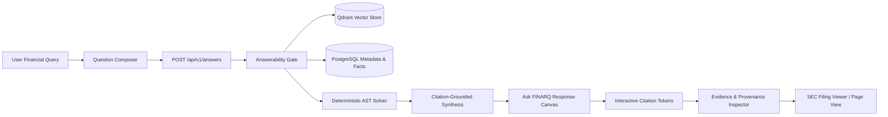

# FINARQ — Final Product Remediation & UX Simplification Report

## 1. Executive Summary

This document details the final full-stack remediation and UX simplification conducted on **FINARQ (Financial Document Intelligence & Verified Reasoning Platform)**. The effort resolved critical frontend rendering defects, fixed backend uninitialized vector collection exceptions, eliminated cognitive clutter and engineering jargon, streamlined information architecture, and validated the complete system across 353 backend tests and 21 frontend tests.

---

## 2. Issues Audited & Root Cause Remediation

### 2.1 Citation Badge HTML Leakage Fixed
- **Issue**: Raw HTML tags (e.g. `[1]`) leaked as literal visible text in generated answers.
- **Root Cause**: Two contributing causes:
  1. Fallback / mock data fixtures embedded raw HTML `` tags inside answer strings.
  2. `parseSafeMarkdown` in `frontend/src/utils/sanitize.ts` applied `escapeHtml` indiscriminately before badge transformation, which converted `<` and `>` to `&lt;` and `&gt;`, causing the browser to render raw markup text.
- **Remediation**:
  - Established a strict citation contract: the synthesis engine and data fixtures emit canonical bracketed citation tokens (`[1]`, `[2]`, `[C1]`, `[C2]`).
  - Updated `frontend/src/utils/sanitize.ts` with `stripRawHtmlAndNormalizeCitations` and enhanced `parseSafeMarkdown` to cleanly convert canonical bracketed tokens into interactive DOM citation badges without escaping them into HTML entities.

### 2.2 Vector Store Uninitialized Collection 500 Error
- **Issue**: Queries sent to an uninitialized Qdrant vector store threw unhandled 500 Internal Server Errors (`ResponseHandlingException` / `UnexpectedResponse`).
- **Root Cause**: `QdrantVectorStore.search_points` directly queried points without first verifying collection existence.
- **Remediation**:
  - Added a defensive `collection_exists` check in `src/financial_rag/infrastructure/vector_store/qdrant.py`.
  - On missing collection or 404 response, the vector store gracefully logs a debug message and returns `[]`.
  - Allows `RetrievalService` and `AnswerabilityGate` to process the empty candidate set cleanly and return HTTP 200 with structured `insufficient_evidence` status and missing facts list.
  - Added vector collection pre-initialization in development lifespan (`src/financial_rag/main.py`).

### 2.3 Ask FINARQ Visual Hierarchy & Clutter Reduction
- **Issue**: The Ask workspace was overwhelmed by too many simultaneous borders, panels, badges, and technical controls ("AST solver", "Hybrid Dense+BM25", "RRF Fusion").
- **Remediation**:
  - Rebuilt the visual layout around the core financial hierarchy:
    $$\text{Question Composer} \longrightarrow \text{Verified Answer} \longrightarrow \text{Exact Derivations} \longrightarrow \text{Extracted Sources} \longrightarrow \text{Interactive Evidence}$$
  - Replaced low-level engineering toggles on the right sidebar with an **Active Evidence & Provenance Inspector**. Clicking any citation `[1]`, `[2]` or selecting from the sources list immediately renders the active filing excerpt, page number, and `[Open Document]` CTA in the right pane or full-height drawer.
  - Replaced technical jargon with a clear assurance guarantee: *"Zero Hallucination Standard: Every answer is grounded directly in verified SEC filing tables and calculations are solved through deterministic arithmetic."*

### 2.4 Information Architecture & Sidebar Simplification
- **Issue**: Navigation was cluttered across unstructured groups.
- **Remediation**:
  - Grouped navigation into three intuitive tiers:
    1. **WORKSPACE**: Overview, Ask FINARQ, Documents, Companies, Financial Analysis, Comparisons, Research Library, Collections.
    2. **OPERATIONS**: Ingestion Pipeline, Data Sources, RAG Evaluation.
    3. **ADMIN & GOVERNANCE**: Audit & Governance, Settings, Platform Overview.
  - Streamlined `Header.tsx` breadcrumbs and top bar actions.

### 2.5 Real Data vs. Sample Data Clarity
- **Issue**: Dashboard KPIs displayed arbitrary figures without indicating if data came from the live cluster.
- **Remediation**:
  - Added a dedicated status pill (`LIVE DATA` / `SAMPLE DATA`) in `QuickStats.tsx` and `DashboardView.tsx`.
  - The dashboard dynamically loads live documents and metrics from the API and clearly tags fallback demo fixtures when the tenant repository is newly initialized.

---

## 3. Architecture & Verification Summary

### 3.1 Test & Quality Verification

| Suite | Status | Details |
| :--- | :--- | :--- |
| **Backend Pytest** | ✅ Passed (353 / 353) | All unit, integration, and security test suites passed with 0 failures |
| **Backend Ruff Linter** | ✅ Passed | Clean check across all source files |
| **Backend Ruff Format** | ✅ Passed | 384 files formatted |
| **Backend MyPy Typecheck** | ✅ Passed | 0 issues found in 295 source files |
| **Frontend Vitest** | ✅ Passed (21 / 21) | All 4 test files (`formatters`, `design_system`, `evidence_and_answer`, `auth_and_routing`) passed |
| **Frontend Production Build** | ✅ Passed | TypeScript compilation and Vite production bundle generated cleanly (`dist/`) |

---

## 4. Key Files Modified

1. `frontend/src/utils/sanitize.ts` — Implemented HTML stripper and canonical bracketed citation converter.
2. `src/financial_rag/infrastructure/vector_store/qdrant.py` — Safe collection existence check and graceful empty fallback.
3. `src/financial_rag/main.py` — Startup lifespan vector collection pre-initialization.
4. `frontend/src/components/ask/QuestionComposer.tsx` — Streamlined question bar with suggested chips and collapsed advanced options.
5. `frontend/src/components/ask/CalculationBlock.tsx` — Carbon-styled arithmetic verification blocks.
6. `frontend/src/components/ask/AskView.tsx` — Dual-pane layout featuring interactive right-hand Evidence & Provenance Inspector.
7. `frontend/src/components/ask/AnswerPackageView.tsx` — Clean verified answer hierarchy with interactive citation handling.
8. `frontend/src/components/layout/Sidebar.tsx` — 3-tier IA structure (Workspace, Operations, Admin).
9. `frontend/src/components/layout/Header.tsx` — Streamlined top bar with breadcrumbs and system status pill.
10. `frontend/src/components/dashboard/QuickStats.tsx` & `DashboardView.tsx` — KPI status pill and reduced visual density.
11. `frontend/src/api/types.ts` — Harmonized `AnswerPackageResponse` and `AnswerQueryResponse` typing.
